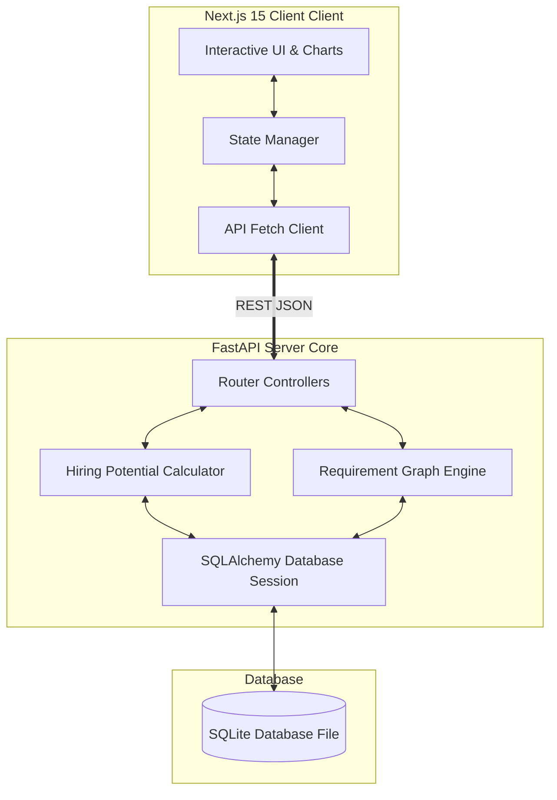

# 🧠 TrustHireBrain (THB)

### Beyond Resume Matching — Trustworthy AI Hiring Intelligence

An Explainable AI Hiring Intelligence Platform that builds Candidate Intelligence Profiles, understands job requirements, infers missing skills, analyzes career evolution, validates trust, and predicts hiring potential using multi-intelligence reasoning.

🏆 **Built for India Runs x Redrob AI Challenge 2026**

<p align="center">
  
  
  
  
  
  
</p>

---

## 2. Problem Statement

Traditional Applicant Tracking Systems (ATS) rely on surface-level keyword frequency matchers. This creates a flawed matching pipeline:

```text
Traditional ATS: 
Job Description Keywords ──> Resume Scanning ──> Match Score (Regex Count) ──> Top Ranked Candidates
```

### Critical Bottlenecks of Legacy Systems:
*   **Misses Hidden/Adjacent Skills:** Candidates with rich experience might use different synonyms or fail to list exact acronyms (e.g., matching "Deep Learning" but missing "Neural Networks").
*   **Zero Explainability:** Algorithms yield black-box scores with no context or breakdown, leaving hiring managers to manually verify suitability.
*   **Ignores Experience Trust:** Treats self-reported resume bullets as absolute truths without verifying credentials or detecting anomalies.
*   **Ignores Career Growth Evolution:** Fails to analyze progression speed, company prestige, or trajectory changes over time.
*   **No Reasoning Capabilities:** Lacks multi-dimensional evaluation of soft skills, execution capabilities, and leadership alignment.

---

## 3. Our Solution: Semantic Multi-Intelligence Reasoning

TrustHireBrain replaces simple filters with a multi-layered semantic evaluation pipeline:

```text
Job Description ──> Requirement Graph ──> Knowledge Graph ──> Skill Inference 
      │
      └──> Candidate Profile ──> Career Evolution ──> Technology Timeline ──> Hiring Potential & Trust Rating
```

Rather than checking for exact string occurrences, THB models candidate suitability across 8 core intelligence dimensions, weighting evidence dynamically against the requirement graph to explain exactly **why** a candidate is suitable.

---

## 4. Why TrustHireBrain?

| Feature Dimension | Traditional ATS | TrustHireBrain (THB) |
| :--- | :--- | :--- |
| **Match Mode** | Keyword Matching | Requirement Intelligence Engine |
| **Scoring Target** | Resume Similarity | Real Hiring Potential Rating |
| **Skill Understanding** | Static Strings | Dynamic Skill Graph Inference |
| **Explainability** | Black Box | Explainable AI Breakdown & Evidence |
| **Profile Integrity** | Single Flat Score | Multi-Intelligence Profile Dimensions |
| **Trust Layer** | No Trust Verification | Credentials & Experience Trust Validation |
| **Career Analytics** | No Career Analysis | Career Evolution & Promotion Trajectory |
| **Uncertainty** | No Confidence Metrics | Confidence Estimation Percentage |

---

## 5. Feature Catalog

### 📋 Requirement Intelligence
*   **Multi-Format Upload:** Direct support for drag-and-drop file uploads (`.pdf`, `.docx`, `.txt`) or manual text entry.
*   **Requirement Graph:** Visual SVG network representation of skills dependency mapping.
*   **Weight Customization:** Real-time editing of parsed skill priorities (Critical, Important, Preferred) and weight scores.

### 👤 Candidate Intelligence
*   **Dynamic Parsing:** Automated parsing of candidate profiles directly into relational models.
*   **Career & Tech Timeline:** Chronological mapping of roles, promotions, and technology stack adoptions.
*   **Knowledge Graph:** Semantic inference linking self-declared skills with related auxiliary frameworks.

### 🧠 Decision & Match Intelligence
*   **Hiring Potential Engine:** Dynamically calculates candidate fit by mapping profile strength against JD requirement graphs.
*   **Trust Score Validation:** Heuristic verification of experience alignment, career gaps, and skill validation.
*   **Confidence Estimation:** Provides a confidence metric for each rating to reflect match certainty.
*   **Explainable Evidence Notes:** Generates real-time textual explanations of candidate strengths and risks.

### 📊 Platform Analytics & Dashboard
*   **Real-time Shortlist:** Dynamic ranking list updating instantly when sliders are adjusted.
*   **Visualization Suite:** Recharts-powered graphs showing experience ranges, trust score spreads, and skill distribution.
*   **Detailed Drawers:** Pop-out detail views showing a deep dive into candidate profiles.
*   **Side-by-Side Comparison:** Interactive side-by-side comparison modal for candidate matching metrics.

---

## 6. Screenshots & Workspace Views

### 1. Interactive Main Dashboard


### 2. Live Dynamic Analysis Workspace


### 3. Job Description Parser & Skill Graph Priority Table


---

## 7. System Architecture

THB's backend and frontend are strictly separated to support high-throughput AI inference pipelines and real-time state synchronization:



---

## 8. Candidate Intelligence Profile Dimensions

To build a holistic view, THB evaluates candidate profiles across 8 core dimensions:

1.  **Technical Intelligence:** Verifiable depth in core programming stacks, libraries, and architecture frameworks.
2.  **Leadership Intelligence:** Management experience, mentorship history, team-leading metrics, and ownership signals.
3.  **Trust Intelligence:** Verification indicator assessing career consistency, credentials, and anomaly detection.
4.  **Learning Intelligence:** Adaptability rating reflecting self-taught skills, transition speeds, and stack changes.
5.  **Innovation Intelligence:** Patents, open-source contributions, research publications, and product launch history.
6.  **Behavioural Intelligence:** Interpersonal qualities, collaboration signals, and role communication alignment.
7.  **Career Intelligence:** Progression speed, promotion intervals, and company growth trajectories.
8.  **Execution Intelligence:** Hands-on product delivery, system scaling metrics, and project ownership signals.

---

## 9. Project Execution Workflow

```text
[1. Upload/Paste JD] ──> [2. Parse Requirements & Graph] ──> [3. Setup Weights Sliders]
                                                                     │
                                                                     ▼
[6. Export Excel/PDF] <── [5. View Recalculated Shortlist] <── [4. Execute Scoring Engine]
```

---

## 10. Technologies & Frameworks

| Layer | Technology / Library | Role in Platform |
| :--- | :--- | :--- |
| **Frontend** | Next.js 15 (Turbopack) | Dynamic Single Page UI |
| **Backend** | FastAPI (Python 3.12) | Real-time REST API Server |
| **Database** | SQLite (SQLAlchemy ORM) | Relational candidate data and logs |
| **NLP & Text** | spaCy (`en_core_web_sm`) | Keyword, noun, and skill extraction |
| **Graph Network** | NetworkX | Skill dependency modeling |
| **Data Engine** | Pandas / NumPy | Tabular analysis & scoring matrix transformations |
| **Visual Charts** | Recharts (React) | High-fidelity data visualization |
| **Styling** | TailwindCSS & Shadcn/UI | Modern Glassmorphic Dashboard Design |

---

## 11. Folder Structure

```text
d:\THB/
├── assets/                # README screenshot assets
├── backend/
│   ├── app/
│   │   ├── api/          # Route endpoint controllers (v1/)
│   │   ├── core/         # Settings, cors configurations
│   │   ├── db/           # SQLite database setup and initial seeds
│   │   ├── engines/      # Modular AI engines (NLP, Vector, Graph, Scoring)
│   │   ├── models/       # Database tables (Candidate, JobDescription, etc.)
│   │   └── main.py       # FastAPI application root startup hook
│   ├── Dockerfile
│   └── requirements.txt
├── frontend/
│   ├── src/
│   │   ├── app/          # Next.js page routes (dashboard, compare, etc.)
│   │   ├── components/   # Reusable UI widgets and layout modules
│   │   ├── context/      # Color themes management contexts
│   │   ├── lib/          # API fetch wrappers
│   │   └── types/        # TypeScript structural types
│   ├── next.config.ts
│   ├── Dockerfile
│   └── package.json
├── docker-compose.yml
└── README.md
```

---

## 12. Local Installation & Setup

### Running with Docker Compose (Recommended)
1.  Clone the repository and run:
    ```bash
    docker compose up --build
    ```
2.  Navigate to `http://localhost:3000` in your web browser.

---

### Manual Dev Execution

#### 1. Setup Backend
1.  Navigate to the backend directory:
    ```bash
    cd backend
    ```
2.  Install dependencies:
    ```bash
    pip install -r requirements.txt
    ```
3.  Launch the FastAPI server:
    ```bash
    uvicorn app.main:app --reload --host 127.0.0.1 --port 8000
    ```

#### 2. Setup Frontend
1.  Navigate to the frontend directory:
    ```bash
    cd ../frontend
    ```
2.  Install dependencies:
    ```bash
    npm install
    ```
3.  Launch Next.js:
    ```bash
    npm run dev
    ```
4.  Open `http://localhost:3000` in your browser.

---

## 13. Research & Engineering Innovation

Instead of relying on standard wrapper APIs, THB leverages custom, modular pipeline components:
*   **Requirement Intelligence Engine:** Uses NetworkX to build a skill dependency graph, assigning weights based on context and priority tags.
*   **Skill Inference Engine:** Extends raw profile listings by scanning professional summaries semantically using spaCy tokenization.
*   **Career Evolution Analysis:** Models promotion paths and YOE ratios to weigh candidates who progress faster.
*   **Trust Validator:** Analyzes employment timelines, matching consistency checks against credentials to verify experience integrity.

---

## 14. Scale & Production Roadmap

```text
Hackathon Phase (Dev Mode) ──> Beta Testing ──> Production SaaS ──> Enterprise Integration
   [SQLite DB, Local Files]      [PostgreSQL,    [Docker Compose,   [Single Sign-On (SSO),
                                  Redis Cache]    Vector Indexes]    Enterprise Integrations]
```

*   **Dev Mode:** Light SQLite relational files for fast local execution.
*   **Production:** PostgreSQL backend with Redis caching clusters and pgvector indexes to accelerate candidate vector matches.

---

## 15. Engineering Decisions

We designed TrustHireBrain around clean engineering decisions rather than coincidental hacks:

| Decision | Why We Chose It |
| :--- | :--- |
| **Modular Engine Architecture** | Allows independent enhancement of NLP, vector, graph, and scoring engines. |
| **Explainable Scoring System** | Recruiters need clear evidence reports, not just black-box scores. |
| **Requirement Graph Mapping** | Captures structured relationship matrices between adjacent technologies. |
| **Confidence Estimation** | Quantifies matches to flag candidates with insufficient evidence. |
| **Next.js 15 + Turbopack** | Provides sub-second hot reloading speeds and modern Server Components structure. |

---

## 👥 The Team
*   **Gurleen** — Principal Software Architect & AI Engineer
    *   [GitHub Profile](https://github.com/Gurleen12star)

---

## 📄 License
This project is licensed under the MIT License.
