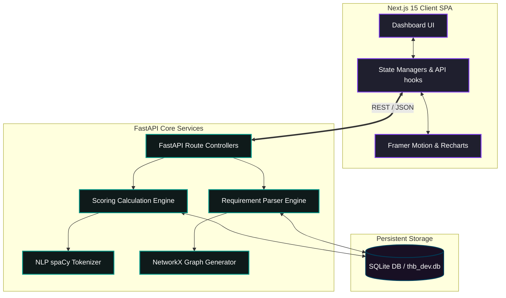

# 🧠 TrustHireBrain (THB) — AI Hiring Intelligence Platform

<p align="center">
  
  
  
  
  
  
</p>

---

## 🎯 Platform Philosophy & Mission

> **Traditional systems answer:** *"Who looks similar?"* (Static resume keyword matchers).  
> **TrustHireBrain answers:** *"Who has the highest hiring potential, and why?"* (Explainable AI matchmaking).

TrustHireBrain (THB) is a production-quality, explainable AI hiring intelligence platform. It replaces shallow keyword-matching filters with a semantic matchmaking algorithm that evaluates candidates across capability, trust verifications, experience depth, and adaptability, rendering explainable candidate ratings directly to recruitment dashboards.

---

## 🚀 Key Feature Modules

*   **Requirement Intelligence Engine (`/job-descriptions`):** Direct manual JD entry and file upload pipelines (`.pdf`, `.docx`, `.txt`) with animated requirements graphs, live priority adjustments, and weight-tuning syncs.
*   **Candidate Intelligence Engine (`/candidates`):** High-density grids and tables showing candidate details, trust levels, experience, and custom popup modals to register new candidate profiles into the database.
*   **Dynamic Matching Workspace (`/new-analysis`):** Multi-weight sliders (Technical, Leadership, Trust, Adaptability, Behavioral) which recalculate candidate matching potential and sort the shortlist in real-time.
*   **Interactive Requirement Graphs (`/skill-graph`):** SVG-rendered dependency trees representing required vs. preferred technologies.
*   **Side-by-Side Comparisons (`/compare`):** Multi-column dashboard to compare candidate capability scores and risk indices.

---

## 📊 Technical Architecture

The following diagram maps the structural interactions between the frontend SPA, the core FastAPI orchestrator, and database engines:



---

## 📂 Directory Structure

```text
d:\THB/
├── backend/
│   ├── app/
│   │   ├── api/          # FastAPI route endpoint controllers
│   │   ├── core/         # Settings, cors configs, logging
│   │   ├── db/           # Session management & seed routines
│   │   ├── engines/      # AI engine modular stubs (NLP, Vector, Graph, Scoring)
│   │   ├── models/       # Database SQLAlchemy models
│   │   └── main.py       # FastAPI main startup application hook
│   ├── Dockerfile
│   └── requirements.txt
├── frontend/
│   ├── src/
│   │   ├── app/          # Next.js pages workspace (App Router)
│   │   ├── components/   # Modular, responsive UI components
│   │   ├── context/      # Theme contexts (light/dark glassmorphism)
│   │   ├── lib/          # API fetch wrapper helper utilities
│   │   └── types/        # TypeScript structural models
│   ├── next.config.ts
│   ├── Dockerfile
│   └── package.json
├── docker-compose.yml
└── README.md
```

---

## 🛠️ Local Setup & Getting Started

### Method 1: Docker Compose (Recommended)

To run the full stack (Frontend, Backend, and Database seeding) in a unified environment:

1.  Clone the repository and run:
    ```bash
    docker compose up --build
    ```
2.  Open `http://localhost:3000` in your web browser.

---

### Method 2: Manual Installation

#### 1. Setup Backend
1.  Navigate to the backend directory:
    ```bash
    cd backend
    ```
2.  Create and activate a virtual environment:
    ```bash
    python -m venv venv
    .\venv\Scripts\activate  # On Windows
    source venv/bin/activate  # On macOS/Linux
    ```
3.  Install python package dependencies:
    ```bash
    pip install -r requirements.txt
    ```
4.  Start the development server:
    ```bash
    uvicorn app.main:app --reload --host 127.0.0.1 --port 8000
    ```
    *Note: On startup, the SQLite database `thb_dev.db` is auto-initialized and seeded with standard candidate records if empty.*

#### 2. Setup Frontend
1.  Navigate to the frontend directory:
    ```bash
    cd ../frontend
    ```
2.  Install dependencies:
    ```bash
    npm install
    ```
3.  Start Next.js dev compiler:
    ```bash
    npm run dev
    ```
4.  Open `http://localhost:3000` in your browser.

---

## 📡 REST API Reference

| Method | Endpoint | Description | Request Body / Parameters |
| :--- | :--- | :--- | :--- |
| **GET** | `/api/v1/dashboard/metrics` | Retrieve aggregated platform metrics counters | None |
| **GET** | `/api/v1/dashboard/progress` | Get active stepper evaluation progress percentages | None |
| **GET** | `/api/v1/dashboard/job-description` | Get current active job description and skill weights | None |
| **POST** | `/api/v1/dashboard/job-description` | Create or update active job description | `{title, location, department, experience_required, description}` |
| **PUT** | `/api/v1/dashboard/job-description/skill/{skill_id}` | Edit weight or priority type of a job description skill | `{type, score}` |
| **GET** | `/api/v1/candidates` | Get filtered list of candidates from DB | `search`, `status`, `minExperience`, `minTrust`, `minPotential` |
| **POST** | `/api/v1/candidates` | Register a new candidate profile into database | `{name, yoe, role, company, location, trust_score, hiring_potential, ...}` |
| **POST** | `/api/v1/dashboard/analysis/start` | Trigger matching algorithm with custom sliders weights | `{technical_weight, leadership_weight, trust_weight, learning_weight, ...}` |
| **GET** | `/api/v1/analytics` | Retrieve analytics chart data lists | None |

---

## 🌐 Deployment Instructions

Deploy the application to cloud hosting platforms for public access:

### 1. Backend (FastAPI + SQLite) on Render
1.  Go to [Render](https://render.com) and create a new **Web Service**.
2.  Connect your GitHub repository.
3.  Configure:
    *   **Root Directory:** `backend`
    *   **Environment:** `Docker` (Render reads `backend/Dockerfile` automatically)
    *   **Instance Type:** `Free`
4.  Click **Deploy Web Service** and copy your deployment URL (e.g. `https://thb-backend.onrender.com`).

### 2. Frontend (Next.js) on Vercel
1.  Go to [Vercel](https://vercel.com) and create a **New Project**.
2.  Connect your GitHub repository.
3.  Configure:
    *   **Framework Preset:** `Next.js`
    *   **Root Directory:** `frontend`
    *   **Environment Variables:** Add `NEXT_PUBLIC_API_URL` pointing to your Render backend API (e.g., `https://thb-backend.onrender.com/api/v1`).
4.  Click **Deploy**.

---

## 📄 License
This project is licensed under the MIT License.
